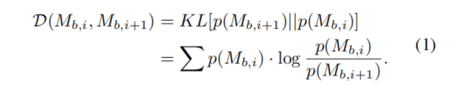
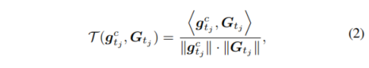
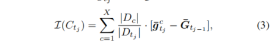
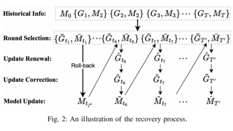

## 研究背景
针对于一个容易受到中毒攻击的联邦学习模型：通过污染其本地的训练数据或在第二步上直接操纵模型更新而不遵循规定的联邦学习协议来构建其恶意模型的更新
针对于联邦学习的中毒模型，分为定向投毒和非定向投毒；
    定向投毒：攻击者目标是投毒全局模型，使其对攻击者选择的目标测试输入预测攻击者选择的目标标签，但对其他测试输入的预测不受影响。
    非定向投毒：针对大量测试输入无差别地提高全局模型的测试错误率。

## 现有技术的局限性
·检测恶意的客户端再去研究可能模型已经中毒颇深了

·与从头训练的模型恢复相比，减少了客户端的重复计算。
·需要所有参与的客户端的历史信息
·服务器的存储资源和客户端的重复计算资源

## Crab的改进措施
部分的重要的非全部历史信息
基于更新较好的历史模型实现高效的恢复并且是自适应

## 具体实现
·卡方散度（KL divergence）：衡量全局模型与后续的全局模型之间的差异，选择FL的训练伦茨

·余弦相似度选择客户端

·敏感性分析 评估每个历史模型对恶意客户端的敏感程度，以确定最适合的回滚模型

模型的更新过程中不同阶段的全局模型对恶意客户端攻击表现出不一样的敏感性，主要是由于以下几个因素的综合作用：

1. **训练数据的差异**：

	* 在模型训练的早期阶段，模型可能只接触到了一小部分训练数据。由于数据量的限制，模型可能还没有完全学习到数据的内在规律和分布，因此更容易受到恶意客户端提供的异常或恶意数据的影响。
	* 随着训练的进行，模型逐渐接触到更多的训练数据，并学会了更好地泛化到未见过的数据上。这使得模型对恶意客户端的攻击变得相对不那么敏感。

2. **模型复杂度的变化**：

	* 在模型训练的早期阶段，模型可能相对简单，其参数和结构还没有完全优化。这使得模型更容易受到恶意客户端提供的精心构造的对抗样本或恶意更新的影响。
	* 随着训练的进行，模型逐渐变得复杂，并学会了更好地捕捉数据的细微差别和特征。这使得模型对恶意客户端的攻击具有更强的抵抗能力。

3. **学习率的调整**：

	* 在模型训练的早期阶段，为了加快学习速度，通常会使用较大的学习率。然而，较大的学习率也可能导致模型对恶意客户端的攻击更加敏感，因为恶意更新可能会对模型参数产生更大的影响。
	* 随着训练的进行，学习率通常会逐渐减小，以确保模型能够更稳定地收敛到最优解。较小的学习率使得模型对恶意客户端的攻击具有更强的鲁棒性。

4. **正则化和优化算法的影响**：

	* 在模型训练过程中，正则化和优化算法的选择也会对模型对恶意客户端攻击的敏感性产生影响。例如，某些正则化技术（如L2正则化）可以帮助模型学习到更平滑的决策边界，从而降低对恶意更新的敏感性。
	* 同时，不同的优化算法（如SGD、Adam等）也可能导致模型在训练过程中表现出不同的敏感性。

5. **模型更新机制**：

	* 在某些情况下，如联邦学习中，模型的更新是分布式的，并且依赖于多个客户端的贡献。如果某些客户端是恶意的，它们可能会提供错误的更新来干扰全局模型的训练。在这种情况下，全局模型对恶意客户端攻击的敏感性将取决于更新机制的设计和实现方式。
	* 例如，如果更新机制没有采用适当的聚合策略或验证机制来过滤掉恶意更新，那么全局模型就可能更容易受到恶意客户端攻击的影响。

综上所述，模型的更新过程中不同阶段的全局模型对恶意客户端攻击表现出不一样的敏感性是由于多种因素的综合作用。为了提高模型的鲁棒性并降低其对恶意客户端攻击的敏感性，需要在训练过程中综合考虑这些因素并采取适当的措施。

某些恶意客户端的模型梯度可能不会被记录，因此它的影响可以忽略不计。

目前的规划：
1.先去看近期的有关fedrecover、federaser以及unlearning的回溯机制恢复方法，看有是否关于加密存储的方面的研究
2.去看两篇比较新的关于联邦学习中毒攻击，主要是后门攻击和修剪攻击的，了解目前的攻击技术，以及有关于信息加密存储相关的文献。还有包括恶意客户端的检测方法，聚合方式，选取的优化算法、

3.过程当中针对于取消学习有关于模型恢复的内容做一些积累，想一下取消学习和模型恢复的连接点。类似于车联网应用这一篇的思路。

4.对于sd模型的高斯模糊的逆过程有了一定技术之后再去做细化，代码不开源，

联邦学习的服务器存放的数据会被篡改吗

以下是一些关于联邦学习和类似FedRecover模型的研究文献，特别关注中毒攻击恢复及历史信息的加密存储和检索：

1. **Federated Learning with Poisoning Attacks**:
   - Yang, Y., et al. "Poisoning Attacks Against Federated Learning: A Case Study on Image Classification." *IEEE Transactions on Neural Networks and Learning Systems* (2020). 这篇文章讨论了联邦学习中的中毒攻击，并探讨了防御策略。

2. **FedRecover: A Model for Recovery from Poisoning Attacks**:
   - Li, T., et al. "FedRecover: A Framework for Recovering from Poisoning Attacks in Federated Learning." *Proceedings of the 38th International Conference on Machine Learning* (2021). 该研究提出了一种模型来从中毒攻击中恢复，使用历史信息来增强鲁棒性。

3. **Encrypted Federated Learning**:
   - Wang, S., et al. "Encrypted Federated Learning: A New Framework for Privacy-Preserving Machine Learning." *IEEE Transactions on Information Forensics and Security* (2020). 本文讨论了在联邦学习中如何进行加密存储和检索以保护数据隐私。

4. **Secure Federated Learning**:
   - Zhang, Y., et al. "Secure Federated Learning: A Privacy-Preserving Approach for Data Storage and Processing." *Journal of Information Security and Applications* (2021). 该研究探讨了加密存储和检索在联邦学习中的应用，特别是在中毒攻击情境下。

5. **Survey on Attacks and Defenses in Federated Learning**:
   - Bhagoji, A. N., et al. "Analyzing Federated Learning Through an Adversarial Lens." *arXiv preprint arXiv:1902.01046* (2019). 这篇综述文章探讨了联邦学习中的多种攻击及其防御机制，包括历史信息的加密存储。

你可以根据这些文献的主题进行深入研究，找出相关的加密存储和检索方法。希望这些文献对你有帮助！如果需要更详细的具体文献或帮助，随时告诉我。

# 车联网中的federated unlearning
1）可以擦除历史更新
2）对于客户端可以随时动态地选择加入离开
3）利用回溯机制从中毒攻击中会付出合适的全局模型
    从全局模型中删除即将遗忘的客户端的更新,随后基于柯西中值定理构建了一个恢复函数，该函数使用服务器上保留的历史模型和梯度方向,在恢复过程中，服务器会估计剩余客户端的模型梯度
    我们采用L-BFGS算法 [ 34,35 ] 来计算柯西中值定理中Hessian矩阵的近似值
