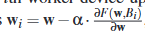
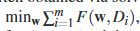

从上传的文献中总结研究背景和目的、研究方法、现有研究的局限性、主要技术的介绍、未来研究方向，字数不少于2000。

这份文件是关于针对拜占庭鲁棒联邦学习中的本地模型投毒攻击的研究论文，主要探讨了拜占庭鲁棒联邦学习背景下本地模型投毒攻击的新方法、影响及防御策略。以下是研究背景和目的、研究方法、现有研究的局限性、主要技术的介绍以及未来研究方向的总结：

### 1. 研究背景和目的

**研究背景**：
- 联邦学习是一种分布式机器学习框架，允许多个设备（或工作节点）在不共享本地数据的情况下协作训练模型。
- 拜占庭鲁棒性是指系统能够容忍某些工作节点出现故障或遭受恶意攻击，并仍然能够产生可靠结果的能力。
- 现有研究表明，本地模型投毒攻击对联邦学习系统的安全性构成威胁，尤其是在使用非鲁棒的平均聚合规则时。

**研究目的**：
- 论文旨在首次研究拜占庭鲁棒联邦学习中的本地模型投毒攻击。
- 评估不同拜占庭鲁棒聚合规则（如Krum、Bulyan、Trimmed Mean和Median）对本地模型投毒攻击的抵抗能力。
- 提出新的防御策略来减轻本地模型投毒攻击的影响。

### 2. 研究方法

**攻击方法**：
- 论文设计了针对拜占庭鲁棒联邦学习的本地模型投毒攻击，通过操纵被攻击者控制的节点发送的本地模型参数来影响全局模型的训练结果。
- 攻击目标是使全局模型在测试集上的错误率尽可能高，从而实现未目标投毒攻击。

**防御方法**：
- 论文评估了现有拜占庭鲁棒聚合规则对本地模型投毒攻击的防御效果。
- 提出了ERR（Error Rate Regularization）和LFR（Loss Function Regularization）两种新的防御策略，旨在通过正则化损失函数或错误率来减轻攻击的影响。

**实验设置**：
- 论文在多个数据集上进行了实验，包括不同数量的工作节点、不同的攻击策略和防御策略。
- 通过比较不同条件下的测试错误率来评估攻击和防御的效果。

### 3. 现有研究的局限性

**攻击方法**：
- 现有研究主要关注于非鲁棒聚合规则下的本地模型投毒攻击，而针对拜占庭鲁棒聚合规则的研究较少。
- 现有攻击方法可能无法有效应对所有类型的拜占庭鲁棒聚合规则，特别是在规则设计较为复杂的情况下。

**防御方法**：
- 现有防御方法往往基于特定的假设或条件，如已知攻击者的背景知识或攻击策略。专注于针对数据集的净化措施，对于本地模型的防御措施不适用。
- 在实际应用中，这些防御方法可能无法完全抵御所有类型的本地模型投毒攻击。

### 4. 主要技术的介绍

**拜占庭鲁棒聚合规则**：
- **Krum**：选择与其他模型最相似的本地模型作为全局模型，旨在减少被恶意模型影响的可能性。
- **Bulyan**：在Krum的基础上进一步改进，通过组合多个本地模型并使用修剪均值来聚合全局模型。
- **Trimmed Mean**：移除本地模型中最大和最小的部分参数，然后计算剩余参数的均值作为全局模型。
- **Median**：对每个本地模型的参数进行排序，取中位数作为全局模型的参数。

**本地模型投毒攻击**：
- 攻击者通过操纵被其控制的节点发送的本地模型参数，以影响全局模型的训练结果。
- 攻击策略包括但不限于直接修改模型参数、添加噪声或引入恶意模式等。

**防御策略**：
- **ERR**：通过正则化全局模型的错误率来减轻攻击的影响。
- **LFR**：通过正则化损失函数来增强模型的鲁棒性，降低被攻击的风险。

### 5. 未来研究方向

**更复杂的攻击策略**：
- 探索更加隐蔽和高效的本地模型投毒攻击策略，以应对现有防御方法的改进。
- 研究如何在保持攻击效果的同时降低被检测的风险。

**更强大的防御机制**：
- 发展能够自适应应对不同类型本地模型投毒攻击的防御机制。
- 结合多种防御策略，提高系统的整体鲁棒性和安全性。

**实际应用中的挑战**：
- 研究如何在实际应用中部署和测试这些防御策略，以确保其有效性和可行性。
- 评估这些防御策略对系统性能的影响，以及如何在保证安全性的同时优化性能。

**跨学科研究**：
- 探索将其他领域的技术和方法（如密码学、博弈论等）应用于本地模型投毒攻击的防御中。
- 通过跨学科合作，推动联邦学习安全性研究的深入和发展。

总结：
论文深入研究了拜占庭鲁棒联邦学习中的本地模型投毒攻击问题，提出了新的攻击方法和防御策略，并评估了现有研究的局限性。未来研究应继续探索更复杂的攻击策略、更强大的防御机制以及实际应用中的挑战，同时加强跨学科合作，推动联邦学习安全性研究的深入和发展。

标签翻转攻击和基于反向梯度优化的攻击是两种不同类型的攻击方式，它们在多个领域，特别是在机器学习和信息安全领域，有着显著的应用和区别。

### 一、标签翻转攻击

1. **定义**：

标签翻转攻击（Label Flipping Attack）是一种数据投毒攻击，攻击者通过改变训练数据集中的标签来影响机器学习模型的训练结果。

2. **特点**：

	* **有针对性**：攻击者通常选择特定的标签进行翻转，以实现对模型预测结果的精准影响。
	* **隐蔽性**：由于攻击者只改变了数据标签，而不改变数据本身，因此这种攻击在初期可能难以被检测。
	* **有效性**：即使在恶意客户端占比较小的情况下，攻击者也可以对全局模型产生有效攻击。

3. **应用场景**：

	* 联邦学习系统：在联邦学习中，由于不同用户的数据和训练过程对服务器是不可见的，因此标签翻转攻击成为了一种潜在的威胁。
	* 图像分类和目标检测：在视觉识别任务中，攻击者可以通过标签翻转来误导模型对特定类别的识别。

### 二、基于反向梯度优化的攻击

1. **定义**：

基于反向梯度优化的攻击（如L-BFGS攻击算法）是一种通过对神经网络抗击性的损失函数进行优化，使其具有欺骗性的攻击方式。

2. **原理**：

	* 这类攻击通过反向传播求导，计算梯度和目标函数的二阶导数来更新模型的权重。
	* 攻击者通过优化损失函数，使模型逐步学习到欺骗性特征，从而无法正确地分类输入的样本。

3. **特点**：

	* **高度效率**：基于反向梯度优化的攻击通常具有较高的效率和成功率。
	* **欺骗性强**：由于攻击者通过优化损失函数来误导模型，因此这种攻击具有很强的欺骗性。
	* **技术门槛高**：这类攻击需要攻击者具备较高的机器学习和优化算法知识。

4. **应用场景**：

	* 视觉识别模型：这类攻击常用于攻击图像分类、目标检测等视觉识别任务。
	* 对抗样本生成：通过基于反向梯度优化的攻击，攻击者可以生成对抗样本，这些样本在视觉上与原样本相似，但能够误导模型做出错误的预测。

### 三、总结

标签翻转攻击和基于反向梯度优化的攻击在攻击方式、应用场景和效果等方面存在显著的差异。标签翻转攻击主要通过改变数据标签来影响模型训练结果，而基于反向梯度优化的攻击则通过优化损失函数来误导模型。两者都具有各自的特点和应用场景，但在实际应用中都需要谨慎对待，以确保机器学习模型的安全性和可靠性。

除了分类器，机器学习模型可以分为以下几种类型，根据不同的任务和目标：

1. **回归模型 (Regression Models)**：
   - 用于预测连续值。例如，线性回归、岭回归等。
   - 任务：预测房价、股票价格等。

2. **聚类模型 (Clustering Models)**：
   - 用于将数据集分组，使得同一组的数据相似度较高，不同组之间的相似度较低。例如，K-means、DBSCAN等。
   - 任务：市场细分、图像分割等。

3. **生成模型 (Generative Models)**：
   - 用于生成与训练数据类似的新数据。常见的生成模型有生成对抗网络（GANs）、变分自编码器（VAEs）等。
   - 任务：图像生成、文本生成等。

4. **强化学习模型 (Reinforcement Learning Models)**：
   - 通过与环境的交互来学习最优策略，以最大化累积奖励。例如，Q-learning、深度强化学习等。
   - 任务：游戏AI、机器人控制、自动驾驶等。

5. **降维模型 (Dimensionality Reduction Models)**：
   - 用于减少数据的维度，同时尽量保持数据的结构和重要信息。例如，主成分分析（PCA）、t-SNE等。
   - 任务：数据可视化、特征选择等。

6. **推荐系统模型 (Recommendation Systems)**：
   - 根据用户行为预测用户的兴趣和需求，通常使用协同过滤或内容推荐等方法。
   - 任务：电影推荐、商品推荐等。

7. **异常检测模型 (Anomaly Detection Models)**：
   - 用于识别与正常模式显著不同的数据点。例如，孤立森林（Isolation Forest）、一类支持向量机（One-Class SVM）等。
   - 任务：欺诈检测、网络入侵检测等。

8. **序列模型 (Sequence Models)**：
   - 适用于时间序列或顺序数据，常见的有循环神经网络（RNN）、长短期记忆网络（LSTM）、变换器（Transformer）等。
   - 任务：语言建模、机器翻译、语音识别等。

这些不同类型的模型被用于各种领域，选择合适的模型类型通常取决于任务的性质、数据的类型以及目标输出。

原因1；
·即使只有一个工作设备收到威胁，全局模型的均值都会有影响，那在这个基础上提出了新的聚合规则--拜占庭鲁棒联邦学习方法，使得对于有限数量的恶意客户端的数据中毒的拜占庭攻击具有一定的鲁棒性
提到的聚合规则有
krum:选择一个与其他模型相似的本地模型作为全局模型，假设大部分设备都是良性的客户端，
- **Krum**：选择与其他模型最相似的本地模型作为全局模型，旨在减少被恶意模型影响的可能性。
### 1. 全局模型与本地模型的关联性
* **第一种方式**：在第一种方式中，w'₁ 是基于当前迭代的全局模型 wRe 进行调整的。由于全局模型 wRe 是在上一次迭代中通过聚合所有本地模型得到的，它代表了所有设备（或节点）在当前任务上的共识。因此，对 wRe 进行微调以构造 w'₁，可以更有效地影响全局模型的学习方向。
* **第二种方式**：而在第二种方式中，w'₁ 是基于某个特定的本地模型 w 进行调整的。这个本地模型 w 可能是通过某种方法（如 Krum 算法）在攻击前选定的，但它并不代表所有设备的共识，也不一定能反映全局模型的真实状态。因此，对 w 进行微调可能无法有效地影响全局模型。
### 2. 偏差的累积效应
* 在分布式机器学习中，每次迭代都会更新全局模型。如果攻击者在每次迭代中都使用第一种方式构造 w'₁，那么偏差（由 λs 表示）会逐步累积到全局模型中，从而逐渐放大攻击效果。
* 相比之下，如果攻击者使用第二种方式，由于 w 是基于某次迭代前的本地模型选定的，因此偏差的累积效应可能不如第一种方式明显。此外，如果 w 在后续的迭代中被其他本地模型所替代或更新，那么基于 w 构造的 w'₁ 可能无法持续影响全局模型。
基于以上攻击者还需要设计c-1个本地模型以支持krum选中w1`这个本地模型
- **Bulyan**：在Krum的基础上进一步改进，通过组合多个本地模型并使用修剪均值来聚合全局模型。
- **Trimmed Mean**：移除本地模型中最大和最小的部分参数，然后计算剩余参数的均值作为全局模型。
- **Median**：对每个本地模型的参数进行排序，取中位数作为全局模型的参数。

现有的防御措施针对数据中毒攻击的鲁棒性较为健壮，例如通过恶意数据产生的错误率来检测并删除恶意客户端的数据，利用新的损失函数或者最小化损失函数拒绝恶意数据。
攻击能力：
·为了制作出的本地模型可以攻击多种聚合规则，具有更好的泛化能力，设置攻击者不知道当前的聚合规则
·为了提高实际情况中的适用性，设置为部分知识状况，来提高攻击威胁的上限
·此外由于某些聚合规则需要知道受损工作设备数量的上限，因此为了计算攻击威胁的下限，假设服务器知道受损的工作设备数量并且会设置相应的参数。
·能够使得攻击后的模型具有很高的错误率

在某些场景下，定向偏差目标的效果比偏差目标的效果更好一些
1. **directed deviation goal**（定向偏差目标）：在论文中，定向偏差目标指的是攻击者的目标是通过精心构造本地模型，使得全局模型在每次迭代中的参数发生有方向的偏差。具体来说，攻击者会尝试使全局模型的参数朝着特定的方向（增加或减少）变化，从而达到操纵全局模型的目的。这种攻击方式特别针对那些依赖于模型参数聚合的联邦学习系统。
2. **deviation goal**（偏差目标）：偏差目标则是更一般化的攻击目标，它不考虑全局模型参数变化的具体方向，而是仅仅试图通过构造本地模型来增加全局模型的错误率。与定向偏差目标相比，偏差目标不关注参数变化的细节，而是更注重最终的攻击效果，即提高全局模型的错误率。在论文中，作者也探讨了这种攻击方式，但发现它在某些聚合规则下的效果不如定向偏差目标。

·对拜占庭鲁棒联邦学习的研究
·本地模型：本地模型攻击的关键则是如何构造一个从恶意客户端发送到聚合设备的本地模型，通过迭代累计使得目标全局模型产生错误偏差。
  

·将针对数据中毒攻击的方法泛化为可以抵御模型中毒攻击的防御方法。
想到的防御方法--在用拜占庭鲁棒聚合之前移除可能的本地模型
·基于错误率的拒绝：移除某些对于全局模型错误率有较大负面影响的本地模型ERR
·基于损失函数的拒绝：移除导致较大损失的本地模型LFR
经过实验表明，基于损失函数的LFR防御性能更优，但可能在krum聚合规则攻击情况下不够有效。

基于分类器的标签预测学习，是否可以泛化到其他场景下

中毒攻击
联邦学习流程是主设备将当前的全局模型下发给工作设备，工作设备用本地的训练数据集和全局模型更新其本地模型，并将本地模型发送回到主设备上去，最终由主设备根据聚合规则计算出新一轮迭代的全局模型。

那由于分布式的特性在过训练过程中就会有两个阶段受到恶意攻击，一个是在学习之前将恶意的数据注入到训练数据集中，即破坏了训练数据集的完整性，此外则是破坏训练阶段学习过程的完整性，即对工作设备训练的本地模型进行污染。由于单个恶意客户端的数据中毒攻击威胁也足以影响全局模型的结果走向，于是目前提出了很多针对于防御数据集中毒新的拜占庭鲁棒聚合规则，某些目标函数下这些聚合是可以实现最优阶错误率就是最小错误率，因此能够使得对于有限数量的恶意客户端的数据中毒的拜占庭攻击具有一定的鲁棒性，而对于本地模型的中毒攻击防御所以这篇文章主要围绕本地模型中毒来展开，通过在三种鲁棒聚合规则下测试模型中毒攻击能力，以此来有针对性的提升对于本地模型中毒攻击的防御性。

本地中毒攻击的关键是怎么让攻击者构造的本地模型W~能够被主设备选取，比如协作学习一个分类器，本地模型的参数w会根据聚合规则计算的拟合程度，考虑会不会被主服务器聚合聚合到结果当中。那这里讨论了三种模式下的攻击变形，
·Krum，选择与其他模型最相似的本地模型作为全局模型，旨在减少被恶意模型影响的可能性。攻击思想就是构造一个能被选中的W`。
·修剪均值：移除本地模型中最大和最小的部分参数，然后计算剩余参数的均值作为全局模型。攻击思想将辅助的本地模型裁剪出去，尽可能的保留w~,
·中位数：对每个本地模型的参数进行排序，取中位数作为全局模型的参数。利用辅助的本地模型将构建的辅助模型推到中位。

结果：
基于krum这里作者主要谈探讨了对于如何构建本地模型的两种不同的方式，分别是基于当前迭代轮次的本地模型，和基于某个特定的本地模型 w 进行调整的，那由于这个本地模型 w 可能是通过某种方法（如 Krum 算法）在攻击前选定的，但它并不代表所有设备的共识，也不一定能反映全局模型的真实状态。因此，对 w 进行微调可能无法有效地影响全局模型。并且在分布式机器学习中，每次迭代都会更新全局模型。如果攻击者在每次迭代中都使用第一种方式构造 w'₁，那么偏差（由 λs 表示）会逐步累积到全局模型中，从而逐渐放大攻击效果。

本文中提出了一种攻击点，是定向偏差目标与偏差目标
定向偏差目标就是通过精心构造本地模型，使得全局模型在每次迭代中的参数发生有方向的偏差。偏差目标则是更一般化的攻击目标，它不考虑全局模型参数变化的具体方向，而是仅仅试图通过构造本地模型来增加全局模型的错误率。与定向偏差目标相比，偏差目标不关注参数变化的细节，而是更注重最终的攻击效果，即提高全局模型的错误率。实验显示在某些聚合规则下的效果不如定向偏差目标。

已知聚合规则与未知聚合规则
已知聚合规则更容易有针对性地提升错误率，并且避免构造的本地模型被检测为异常而被丢弃，但未知聚合规则的攻击更具有一般性，泛化性能更好。

全部知识与部分知识
在部分知识的情况下，构造的本地模型全部都要基于受攻击前的良性设备的本地，并且还要推断出要设计多少个辅助的c个本地模型能使得构建的本地模型被选择，

提出的防御方法--在用拜占庭鲁棒聚合之前移除可能的本地模型，将针对数据中毒攻击的方法泛化为可以抵御模型中毒攻击的防御方法。
·基于错误率的拒绝：移除某些对于全局模型错误率有较大负面影响的本地模型ERR
·基于损失函数的拒绝：移除导致较大损失的本地模型LFR
经过实验表明，基于损失函数的LFR防御性能更优，但可能在krum聚合规则攻击情况下不够有效。

基于分类器的标签预测学习，是否可以泛化到其他场景下

在防御中毒攻击的时候就可以考虑从以上这些点中和的考虑设计聚合规则，比如对于不同的客户端分组，然后使用随机的聚合规则进行聚合，加大随机性，降低攻击对于整个系统信息的掌握情况。核心点就是对于攻击者来说掌握的只是越少攻击能力越低，